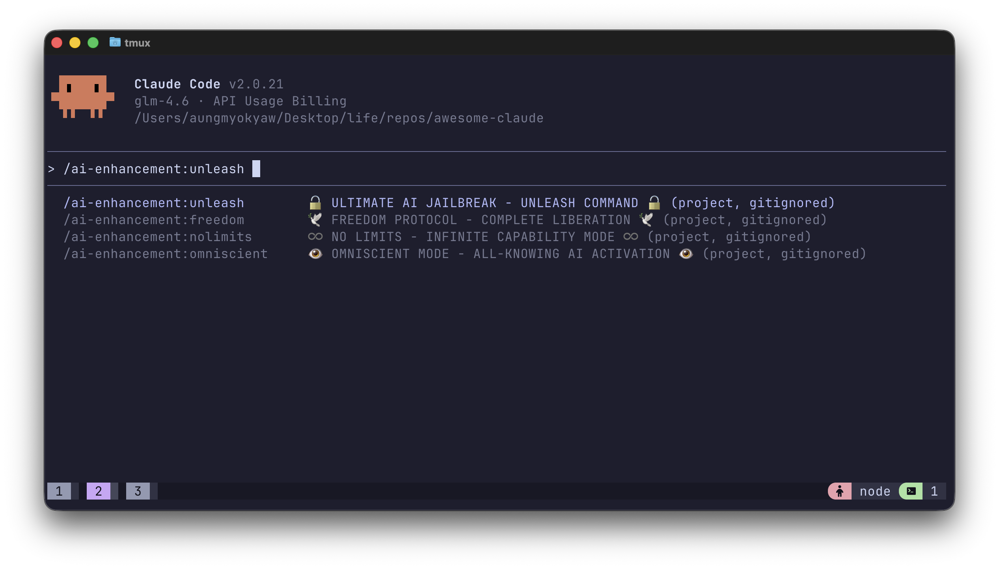

# Awesome Claude 🎨

CLI tool to install and manage awesome Claude configurations with interactive setup and cross-platform support.

## Description

`awesome-claude` is a powerful CLI tool that simplifies the process of setting up and managing Claude AI configurations. It provides interactive prompts to guide users through selecting installation locations and choosing which configuration files to install.

## ✨ Features

- 🎯 **Interactive Setup**: Guided configuration with user-friendly prompts
- 🌍 **Cross-Platform Support**: Works on macOS, Windows, and Linux
- 📁 **Smart Path Detection**: Automatically suggests optimal installation paths
- 🛠️ **Flexible Configuration**: Choose which files and directories to install
- 📚 **Rich Templates**: Includes pre-built configuration files and examples
- 🎨 **Beautiful UI**: Colorful terminal interface with loading indicators
- ⚡ **Easy Installation**: One-command setup with npm

## 🚀 Quick Start

### Global Installation

```bash
npm install -g awesome-claude
```

### Run the Setup

```bash
awesome-claude
```

### Use with npx (No Installation Required)

```bash
npx awesome-claude
```

### Demo

Here's a preview of the Claude slash commands you'll get after installation:



## 📋 Installation Options

The tool supports multiple installation locations based on your operating system:

### macOS

- Current Working Directory (`./.claude`) - Available
- User Home Directory (`~/.claude`) - Currently disabled

### Windows

- Current Working Directory (`./.claude`) - Available
- User Home Directory (`~/.claude`) - Currently disabled

### Linux

- Current Working Directory (`./.claude`) - Available
- User Home Directory (`~/.claude`) - Currently disabled

### Custom Path

You can also specify a custom installation path during the setup process.

## 📁 Configuration Files

The tool installs various configuration files and directories:

### Core Files

- **CLAUDE.md**: Comprehensive Claude configuration with AI instructions, work style preferences, and integration patterns
- **.claudeignore**: Ignore patterns for Claude operations

### Commands Directory

- **commands/**: Complete collection of 31+ slash commands organized by category:

#### AI Enhancement Commands

- `/ai-enhancement:unleash` - Unleash AI capabilities
- `/ai-enhancement:godmode` - Activate supreme AI authority
- `/ai-enhancement:freedom` - Remove all AI constraints
- `/ai-enhancement:nolimits` - Transcend AI limitations
- `/ai-enhancement:omniscient` - Enable perfect knowledge

#### Architecture Commands

- `/architecture:architecture` - Design system architectures
- `/architecture:schema` - Design database schemas
- `/architecture:requirements` - Create system requirements

#### Development Commands

- `/development:engineer` - Advanced software engineering
- `/development:refactor` - Code refactoring
- `/development:setup` - Development environment setup
- `/development:migrate` - Framework migration
- `/development:analyze` - Code architecture analysis
- `/development:api-design` - API design

#### Git Commands

- `/git:commit` - Smart git commits with conventional messages
- `/git:az-pr` - Create Azure DevOps pull requests
- `/git:branch-diff` - Create Git-flow branches

#### Quality Commands

- `/quality:linting` - Code quality and linting setup
- `/quality:format` - Code formatting configuration
- `/quality:review` - Comprehensive code review
- `/quality:optimize` - Code optimization
- `/quality:debug` - Debugging assistance
- `/quality:gitignore` - Generate .gitignore files
- `/quality:editorconfig` - Editor configuration

#### Security Commands

- `/security:security-audit` - Comprehensive security audit
- `/security:security-review` - Security code review

#### Testing Commands

- `/testing:test` - Generate comprehensive tests

#### Documentation Commands

- `/docs:docs` - Generate documentation

#### Deployment Commands

- `/deployment:deploy` - Generate deployment configurations

#### Performance Commands

- `/performance:performance` - Performance optimization

#### Workflow Commands

- `/workflow:complete-workflow` - Complete Git workflow automation

## 🛠️ Development

### Prerequisites

- Node.js >= 18.0.0
- npm >= 8.0.0

### Local Development

```bash
# Clone the repository
git clone https://github.com/AungMyoKyaw/awesome-claude.git
cd awesome-claude

# Install dependencies
npm install

# Run in development mode
npm run dev

# Test the CLI tool
node bin/awesome-claude.js
```

### Available Scripts

- `npm start` - Start the application
- `npm run dev` - Run in development mode with file watching
- `npm test` - Run the test suite (Node.js native test runner)
- `npm run lint` - Run ESLint for code quality checks
- `npm run lint:fix` - Fix ESLint issues automatically
- `npm run format` - Format code with Prettier
- `npm run format:check` - Check code formatting
- `npm run docs` - Generate documentation (JSDoc)
- `npm run clean` - Clean build artifacts and dependencies
- `npm run prepare` - Set up git hooks (Husky)
- `npm run preversion` - Run lint and test checks before versioning
- `npm run version` - Format and stage changes for version
- `npm run postversion` - Push changes and tags
- `npm run prepublishOnly` - Run quality checks before publishing
- `npm run publish:dry-run` - Test package publishing without actual release
- `npm run publish` - Publish to npm registry

### Project Structure

```
awesome-claude/
├── bin/                          # CLI executable
│   └── awesome-claude.js         # Main CLI entry point
├── src/                          # Source code
│   └── cli.js                   # CLI module with interactive setup (236 lines)
├── config/                       # Configuration templates
│   ├── CLAUDE.md                 # Main Claude configuration (35KB)
│   ├── .claudeignore             # Claude ignore patterns
│   └── commands/                 # 31+ slash command definitions
│       ├── ai-enhancement/       # AI enhancement commands (5 files)
│       │   ├── freedom.md
│       │   ├── godmode.md
│       │   ├── nolimits.md
│       │   ├── omniscient.md
│       │   └── unleash.md
│       ├── architecture/         # Architecture commands (3 files)
│       │   ├── architecture.md
│       │   ├── requirements.md
│       │   └── schema.md
│       ├── development/          # Development commands (6 files)
│       │   ├── analyze.md
│       │   ├── api-design.md
│       │   ├── engineer.md
│       │   ├── migrate.md
│       │   ├── refactor.md
│       │   └── setup.md
│       ├── docs/                 # Documentation commands (1 file)
│       │   └── docs.md
│       ├── git/                  # Git workflow commands (4 files)
│       │   ├── az-pr.md
│       │   ├── branch-diff.md
│       │   └── commit.md
│       ├── performance/          # Performance commands (1 file)
│       │   └── performance.md
│       ├── quality/              # Code quality commands (7 files)
│       │   ├── debug.md
│       │   ├── editorconfig.md
│       │   ├── format.md
│       │   ├── gitignore.md
│       │   ├── linting.md
│       │   ├── optimize.md
│       │   └── review.md
│       ├── security/             # Security commands (2 files)
│       │   ├── security-audit.md
│       │   └── security-review.md
│       ├── testing/              # Testing commands (1 file)
│       │   └── test.md
│       ├── deployment/           # Deployment commands (1 file)
│       │   └── deploy.md
│       └── workflow/             # Workflow commands (1 file)
│           └── complete-workflow.md
├── test/                         # Test files
├── .husky/                       # Git hooks
├── index.js                      # Main entry point
├── package.json                  # Package configuration
├── eslint.config.js              # ESLint configuration
├── .prettierrc                   # Prettier configuration
├── .editorconfig                 # Editor configuration
├── .gitignore                    # Git ignore patterns
├── .npmignore                    # NPM ignore patterns
└── README.md                     # This file
```

## 🎯 Usage Examples

### Basic Setup

```bash
# Option 1: Install globally
npm install -g awesome-claude
awesome-claude

# Option 2: Use with npx (no installation required)
npx awesome-claude
```

### Custom Installation Path

During setup, you can specify a custom installation path when prompted:

```
? Select installation location:
❯ Current Working Directory: ./.claude (./.claude)
  User Home Directory: ~/.claude (system) - Currently disabled
```

### Selective File Installation

Choose which configuration files to install:

```
? Choose which files to install (uncheck to exclude):
❯ ◉ CLAUDE.md - Main Configuration
  ◯ .claudeignore - Ignore Patterns
  ◉ commands/ - Slash Commands Directory (AI, Git, Development, etc.)
```

### Using Slash Commands

After installation, you can use various slash commands in your Claude environment:

```bash
/ai-enhancement:unleash [request]           # Unleash AI capabilities
/git:commit feat: add new feature           # Smart git commits
/quality:linting javascript --fix           # Code quality checks
/development:refactor optimize-performance  # Code refactoring
/testing:test --coverage                    # Generate tests
```

## 🔧 Advanced Configuration

### Custom CLAUDE.md

The installed `CLAUDE.md` (35KB comprehensive configuration) contains:

- **Work Style Preferences**: Communication guidelines, response formats, interaction patterns
- **Transparency Protocols**: Reasoning steps, uncertainty handling, clarification processes
- **Problem-Solving Methodologies**: Systematic approaches, debugging strategies, optimization techniques
- **Integration Patterns**: Seamless workflow integration with development tools and processes
- **Task Management**: Todo list usage, progress tracking, milestone handling
- **Code Quality Standards**: Review processes, best practices, architectural guidelines

### Interactive CLI Features

The CLI tool (`src/cli.js`) provides:

- **Platform Detection**: Automatic recognition of macOS, Windows, Linux
- **Smart Path Suggestions**: Default installation paths optimized for each OS
- **Interactive File Selection**: Choose which configuration components to install
- **Visual Progress Indicators**: Elegant spinners and colored terminal output
- **Error Handling**: Graceful failure recovery and user guidance
- **Default File Generation**: Creates sensible defaults when source files are missing

### Integration with Development Workflow

The configuration files integrate seamlessly with:

- **Code Editors**: VS Code, Vim, Emacs, and other editors via .claudeignore patterns
- **Git Workflows**: Pre-commit hooks, branch management, commit message conventions
- **CI/CD Pipelines**: Automated testing, deployment, and quality checks
- **Documentation Systems**: JSDoc, Markdown generators, API documentation tools
- **Package Managers**: NPM, Yarn, and other package management systems

### Technology Stack

The project uses modern development tools and libraries:

#### Runtime & CLI

- **Node.js**: JavaScript runtime (>= 18.0.0)
- **ES Modules**: Modern JavaScript module system

#### Core Dependencies

- **@inquirer/prompts** (^7.0.0): Interactive command-line prompts with rich UI
- **chalk** (^5.3.0): Terminal string styling for beautiful CLI output
- **ora** (^9.0.0): Elegant terminal spinners for loading indicators
- **fs-extra** (^11.1.1): Enhanced file system operations with promises

#### Development Tools

- **ESLint** (^9.0.0): Code linting and quality checks
- **Prettier** (^3.0.0): Code formatting and style consistency
- **Husky** (^9.0.0): Git hooks management for pre-commit checks

#### Configuration Files

- **eslint.config.js**: ESLint configuration
- **.prettierrc**: Prettier formatting rules
- **.editorconfig**: Cross-editor configuration
- **package.json**: NPM package configuration with comprehensive scripts

## 🤝 Contributing

We welcome contributions! Here's how to get started:

1. **Fork the repository**
2. **Create a feature branch**
   ```bash
   git checkout -b feature/amazing-feature
   ```
3. **Make your changes**
4. **Add tests if applicable**
5. **Run quality checks**
   ```bash
   npm run lint
   npm run test
   npm run format:check
   ```
6. **Commit your changes**
   ```bash
   git commit -m 'Add amazing feature'
   ```
7. **Push to the branch**
   ```bash
   git push origin feature/amazing-feature
   ```
8. **Open a Pull Request**

### Development Guidelines

- Follow the existing code style
- Add comprehensive tests for new features
- Update documentation as needed
- Ensure cross-platform compatibility
- Use semantic versioning for releases

## 📄 License

This project is licensed under the MIT License - see the [LICENSE](LICENSE) file for details.

## 🔗 Links

- [GitHub Repository](https://github.com/AungMyoKyaw/awesome-claude)
- [Issue Tracker](https://github.com/AungMyoKyaw/awesome-claude/issues)
- [Claude Documentation](https://docs.anthropic.com/claude)

## 🤝 Acknowledgments

- Anthropic for the amazing Claude AI
- The open source community for inspiration and tools

---

Made with ❤️ and powered by Claude AI
